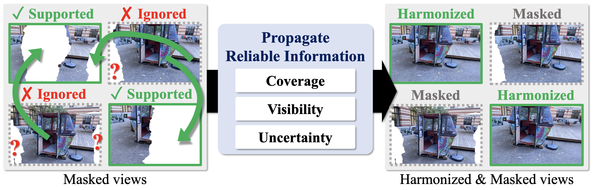
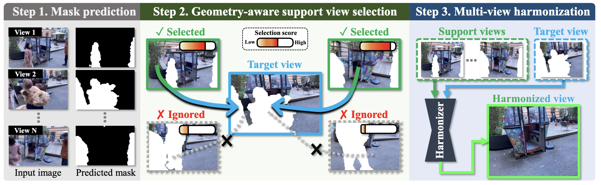

<div align="center">

# PriSplat: Propagating Reliable Multi-view Information for Distractor-Free 3DGS

**Yunseo Yang<sup>*</sup>**, **Youngho Yoon<sup>*</sup>**, **and Kuk-Jin Yoon**  

Visual Intelligence Lab., KAIST

**ECCV 2026**

<sup>*</sup> Equal contribution

</div>

<p align="center">
  
</p>

> **TL;DR.** PriSplat replaces mask-only suppression with **3D-aware multi-view harmonization**. Instead of leaving distractor-masked regions unsupervised, it propagates reliable evidence from other views to create geometrically consistent pseudo-ground truth for 3DGS optimization.

## Overview

Distractor-free 3DGS methods commonly detect transient objects such as pedestrians or vehicles and simply ignore the corresponding pixels during optimization. Although masking prevents the model from fitting distractors, it also removes supervision from the occluded regions, which can lead to per-view overfitting, floaters, ghosting, and local geometry collapse.

**PriSplat** restores this missing supervision by exploiting multi-view redundancy. The pipeline has three steps:

1. **Mask prediction.** We estimate per-view distractor masks during 3DGS optimization using a lightweight mask predictor following prior distractor-free 3DGS pipelines.
2. **Geometry-aware support view selection.** For each masked target view, we select support views that reliably observe the missing region using **Fisher-based information density** together with **spatial and angular compatibility**. Harmonization is skipped when reliable support is insufficient.
3. **Multi-view harmonization.** We repurpose a large-scale NVS prior as a **3D-aware inpainting harmonizer**. A **mask-aware fast-weight update** suppresses unreliable tokens and prevents distractor-corrupted evidence from leaking into the scene memory.

The resulting harmonized views provide dense, view-consistent pseudo-ground truth for the masked regions during the middle stage of 3DGS training.

<p align="center">
  
</p>

## Highlights

- **From masking to harmonization:** recover supervision in distractor-occluded regions instead of discarding it.
- **3D-aware prior:** use an NVS model as a reference-based inpainting engine rather than relying on unconstrained 2D generative inpainting.
- **Reliable support selection:** combine information density, camera distance, and viewing direction to avoid propagating weak or ambiguous evidence.
- **Mask-aware fast weights:** down-weight poorly aligned tokens during test-time adaptation to reduce distractor leakage.
- **Simple three-stage optimization:** masked warm-up → harmonized supervision → masked refinement.

## Training Schedule

All scenes are optimized for **30k iterations**.

| Stage | Iterations | Supervision |
| --- | ---: | --- |
| **1. Mask warm-up** | 0–10k | Masked reconstruction loss on observed pixels |
| **2. Harmonization** | 10k–20k | Dense harmonized pseudo-ground truth when reliable supports are available |
| **3. Masked refinement** | 20k–30k | Return to masked reconstruction loss for final refinement |

Default support-view parameters used in the paper are `τ = 0.3`, `τ_rel = 0.4`, `K_min = 8`, `k_ang = 2`, and `σ_dist = 0.2 × scene_extent`.

## Installation

### 1. Clone the repository

```bash
git clone https://github.com/yun-seo/PriSplat.git
cd PriSplat
```

### 2. Create the environment

The released setup was tested with **Python 3.10**, **PyTorch 2.5.1 + CUDA 12.4**, **gcc 12**, and an **RTX A6000**.

```bash
conda create -n prisplat -c nvidia/label/cuda-12.4.1 -c conda-forge \
    python=3.10 pip ninja gcc_linux-64=12 gxx_linux-64=12 \
    cuda-nvcc cuda-cudart-dev cuda-libraries-dev -y
conda activate prisplat

pip install torch==2.5.1 torchvision==0.20.1 \
    --index-url https://download.pytorch.org/whl/cu124

pip install -r requirements.txt -r lact_utils/train/requirements.txt
```

> `torch>=2.4` is required by the harmonizer code because it uses `torch.nn.RMSNorm`.

### 3. Build CUDA extensions

If you use the conda-provided compiler/toolkit, point the build to them first:

```bash
export CUDA_HOME=$CONDA_PREFIX
export CC=$CONDA_PREFIX/bin/x86_64-conda-linux-gnu-gcc
export CXX=$CONDA_PREFIX/bin/x86_64-conda-linux-gnu-g++
export CPATH=$CONDA_PREFIX/targets/x86_64-linux/include
export LIBRARY_PATH=$CONDA_PREFIX/targets/x86_64-linux/lib:$CONDA_PREFIX/lib

# RTX A6000 = compute capability 8.6. Change this for your GPU.
export TORCH_CUDA_ARCH_LIST=8.6

pip install --no-build-isolation submodules/diff-gaussian-rasterization
pip install --no-build-isolation submodules/fused-ssim
pip install --no-build-isolation submodules/simple-knn
pip install --no-build-isolation diff
```

Check the build:

```bash
python -c "import diff_gaussian_rasterization, simple_knn._C, fused_ssim, modified_diff_gaussian_rasterization"
```

### 4. DINO features

**DINOv2** is loaded automatically through `torch.hub` and requires no manual checkpoint setup.

To use **DINOv3** instead (`--use_dinov3`):

```bash
git clone https://github.com/facebookresearch/dinov3.git dinov3_repo

export DINOV3_REPO=$(pwd)/dinov3_repo
export DINOV3_WEIGHTS=$(pwd)/utils/dinov3_vits16_pretrain_lvd1689m-08c60483.pth
```

### 5. Harmonizer checkpoint

PriSplat expects the pretrained harmonizer checkpoint at:

```text
lact_utils/ckpts/model_0003000.pth
```

The default configuration is:

```text
lact_utils/config/lact_l24_d768_ttt2x.yaml
```

The checkpoint should be a `torch.save` dictionary with a `"model"` key containing the `LaCTLVSM` state dict.

## Dataset

We use the **preprocessed datasets released with [RobustSplat](https://github.com/fcyycf/RobustSplat)**.
Please download the prepared **NeRF On-the-go** and **RobustNeRF** data from:

- [RobustSplat-data (Hugging Face)](https://huggingface.co/datasets/fcy99/RobustSplat-data)

The RobustSplat release already provides the SfM-preprocessed data used by its 3DGS pipeline, so you do not need to rerun COLMAP preprocessing. After downloading, place or symlink the desired scenes under your data root, e.g. `data/mountain`.

## Training

### Quick start

```bash
bash scripts/train.sh mountain
```

The wrapper runs training, rendering, and metric evaluation. Paths and the viewer port can be overridden:

```bash
DATA_ROOT=/path/to/scenes OUT_ROOT=./output PORT=1111 \
    bash scripts/train.sh mountain
```

Add `--disable_viewer` if you do not need the network GUI server.

<details>
<summary><strong>Full training command</strong></summary>

```bash
python train.py \
    -s data/mountain -r 1 \
    --model_path output/mountain \
    --use_inpaint \
    --select_strategy fisherrf \
    --fisherrf_thr 0.4 \
    --final_score 0.3 \
    --use_inpaint_iter 10000 \
    --use_inpaint_iter_end 20000 \
    --mask_dilate 15 \
    --exp_iter_start 3000 \
    --densify_from_iter 10000 \
    --densify_until_iter 20000 \
    --exposure_lr_init 0.005 \
    --lact_config lact_utils/config/lact_l24_d768_ttt2x.yaml \
    --lact_ckpt lact_utils/ckpts/model_0003000.pth
```

</details>

### Key options

| Flag | Purpose |
| --- | --- |
| `--use_inpaint` | enable harmonized pseudo-ground-truth supervision |
| `--use_inpaint_iter` | iteration at which harmonized supervision begins |
| `--use_inpaint_iter_end` | iteration after which harmonized supervision is disabled |
| `--select_strategy` | support-view selection strategy (`fisherrf`, `knn`, `select_knn`, …) |
| `--fisherrf_thr` | relative threshold used by Fisher-based support filtering |
| `--final_score` | minimum combined reliability score for a support view |
| `--mask_dilate` | mask dilation before harmonization |
| `--num_views` | number of support views used by the harmonizer (default: 8) |
| `--use_dinov3` | use DINOv3 features for the mask predictor |
| `--lact_config` | harmonizer model configuration |
| `--lact_ckpt` | harmonizer checkpoint |
| `--save_mask` | save estimated distractor masks every 1000 iterations |

The full option list is defined in `arguments/__init__.py` and at the bottom of `train.py`.

## Rendering and Evaluation

```bash
# Render train/test cameras
python render.py -m output/mountain

# PSNR / SSIM / LPIPS
python metrics.py --result_dir output/mountain
```

Outputs are written to:

```text
output/<scene>/test/ours_<iter>/renders
output/<scene>/test/ours_<iter>/gt
output/<scene>/results.json
```

Training also stores the support-view selection (`selection_all.txt`), harmonized results (`lact_results/`), TensorBoard logs, and `chkpnt<iter>.pth` in the scene output directory.

## Training the Harmonizer from Scratch (Optional)

The released PriSplat pipeline uses a pretrained NVS/harmonization backbone and performs scene-specific fast-weight adaptation during inference. To retrain the backbone on a large multi-view dataset such as DL3DV-10K:

```bash
cd lact_utils/train

# 1) Prepare DL3DV training data
python download.py --odir DL3DV-10K --subset 2K --resolution 960P --file_type images+poses
mkdir -p data_train/dl3dv_benchmark
mv DL3DV-10K/2K/* data_train/dl3dv_benchmark/
python data_preprocess/dl3dv_train_format_converter.py

# 2) Initialize from pretrained weights
mkdir -p weight
wget https://huggingface.co/airsplay/lact_nvs/resolve/main/scene_res512x512.pt \
     -O weight/scene_res512x512.pt

# 3) Train (4 GPUs by default)
bash train.sh

# Single-GPU example
NGPU=1 bash train.sh
```

See `lact_utils/train/README.md` for the full data layout and training options.

## Repository Layout

```text
PriSplat/
├── train.py                     # main training entry point
├── render.py                    # render a trained 3DGS model
├── metrics.py                   # PSNR / SSIM / LPIPS evaluation
├── arguments/                   # command-line argument groups
├── gaussian_renderer/           # rasterization wrappers
├── scene/                       # scene / camera / COLMAP loaders
├── utils/                       # losses, masks, SH, utilities
├── lact_utils/                  # harmonizer + support-view selection
│   ├── pipe/model.py            # LaCTLVSM backbone
│   ├── pipe/lact_ttt.py         # fast-weight test-time update
│   ├── data_inference.py        # dataset + KNN / Fisher selection
│   ├── colmap_to_opencv_json.py # COLMAP -> opencv_cameras.json
│   ├── config/                  # harmonizer configs
│   ├── ckpts/                   # pretrained checkpoints
│   └── train/                   # optional backbone training
├── submodules/                  # 3DGS CUDA extensions
├── diff/                        # modified rasterizer for Fisher scoring
├── prepare/                     # dataset preparation helpers
└── scripts/train.sh             # one-command training example
```

## Acknowledgements

This codebase builds on [3D Gaussian Splatting](https://github.com/graphdeco-inria/gaussian-splatting), uses the fast-weight formulation from [LaCT](https://github.com/tianweiy/LaCT), and incorporates Fisher-based view scoring based on [FisherRF](https://github.com/JiangWenPL/FisherRF). The distractor-mask component is related to prior work including [SpotLessSplats](https://spotlesssplats.github.io/) and [WildGaussians](https://wild-gaussians.github.io/). We evaluate on [NeRF On-the-go](https://rwn17.github.io/nerf-on-the-go/) and [RobustNeRF](https://robustnerf.github.io/).
